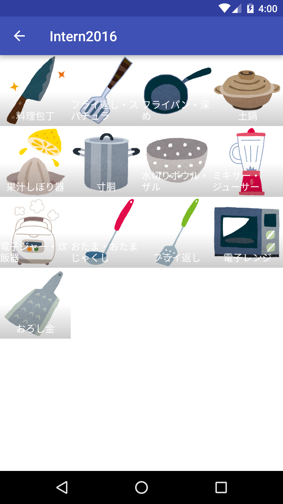
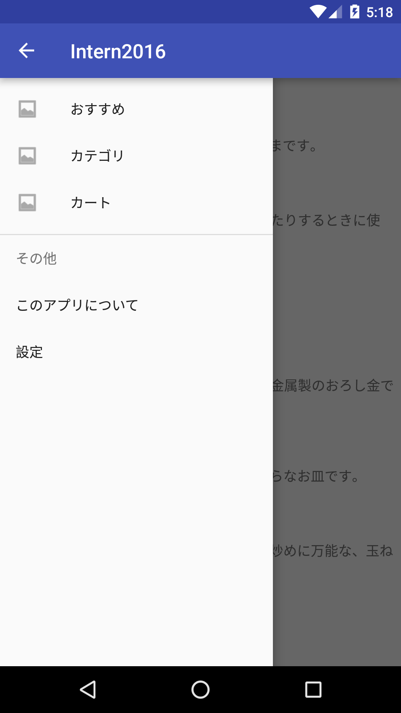

カテゴリ画面を2階層構成で作ってください。

#### 仕様

* カテゴリ一覧画面には「カテゴリ名,カテゴリ画像」を少なくとも表示する。
* カテゴリ内商品一覧画面には「商品名,商品画像」を少なくとも表示する。
* カテゴリ内商品一覧画面から、商品詳細画面に遷移できるようにする。
* トップ画面から遷移できるようにする。

#### 遷移の実装に困った場合

Androidアプリの画面遷移にはいくつかあります。
* ViewPager(左右にスワイプするUI)
* [Bottom Navigation](https://material.google.com/components/bottom-navigation.html#) (画面下部のバー)
* [NavigationDrawer](https://material.google.com/patterns/navigation-drawer.html#) (左に隠れているView)

どのような実装でも構いませんが、実装に困った場合は、[Creating a Navigation Drawer](https://developer.android.com/training/implementing-navigation/nav-drawer.html) を読んで実装してみましょう。

#### 画面サンプル

