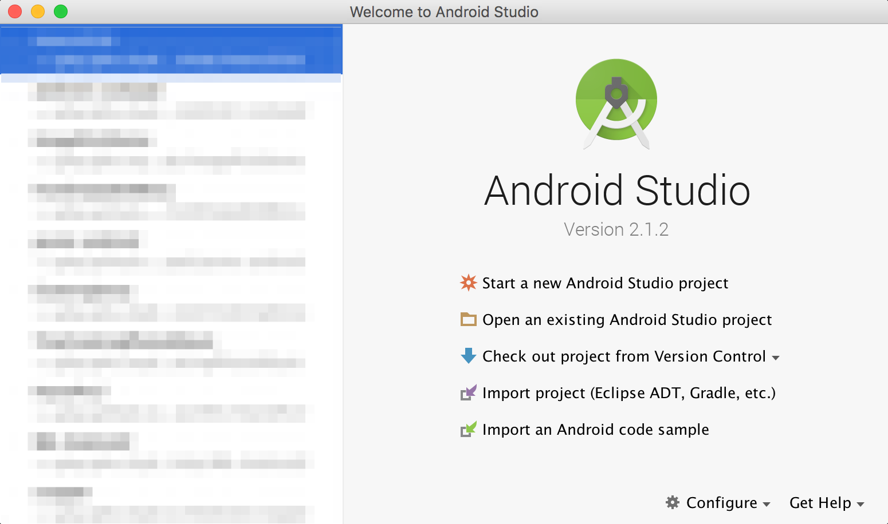
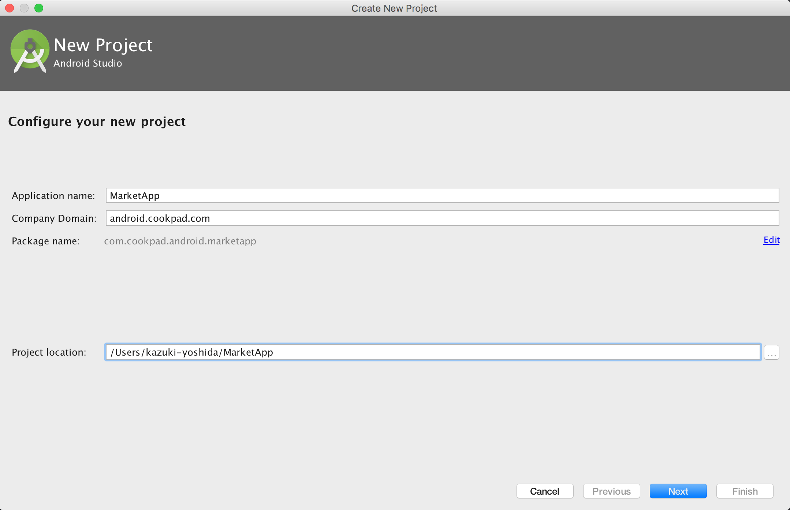
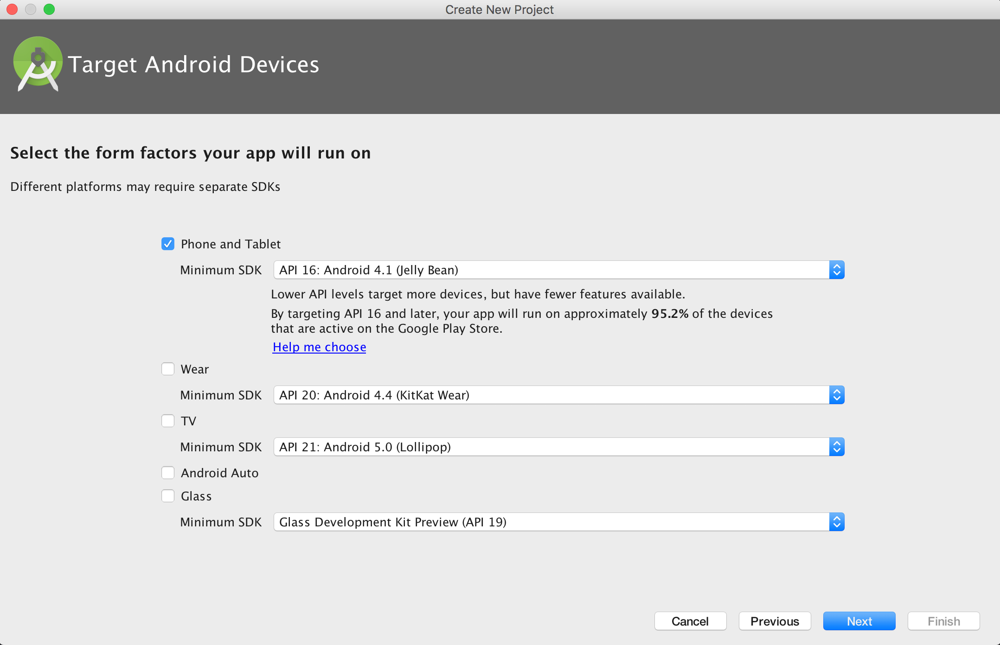
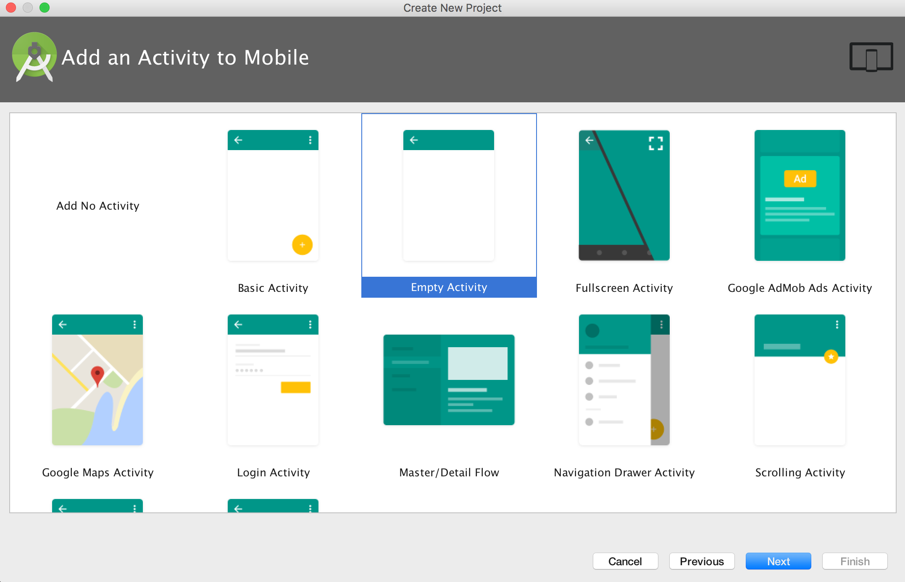
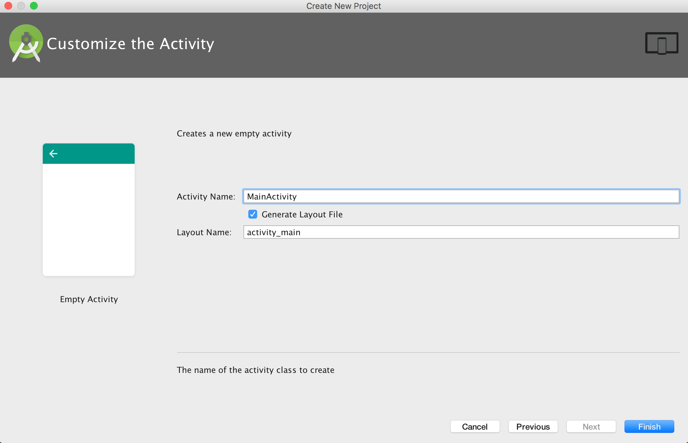
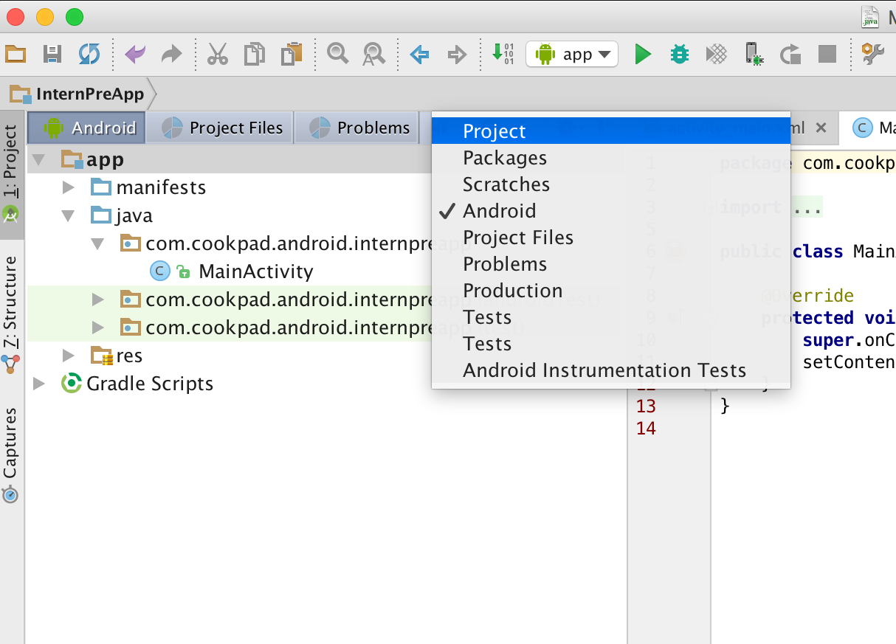
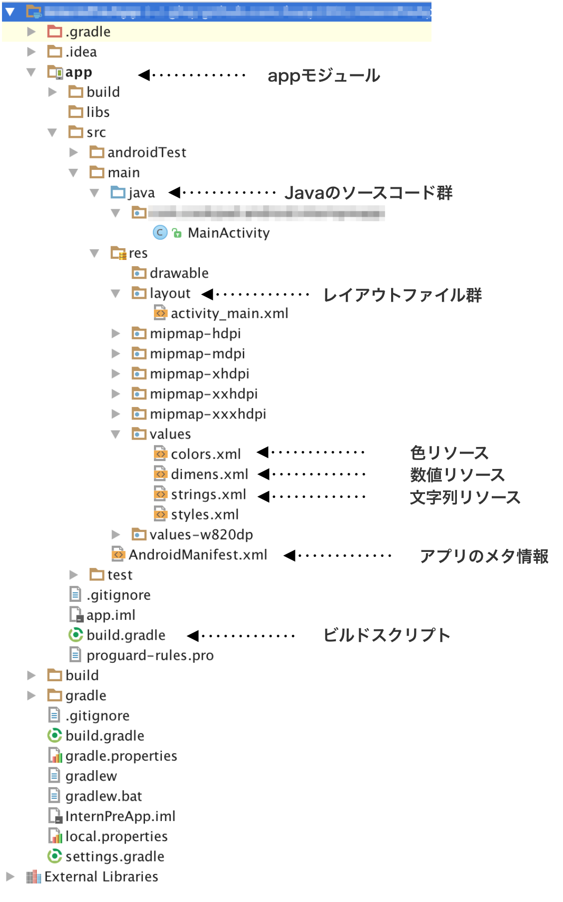
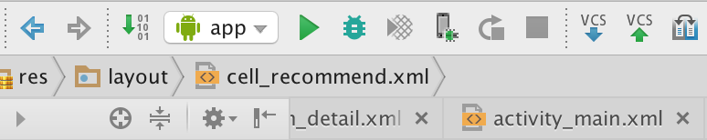
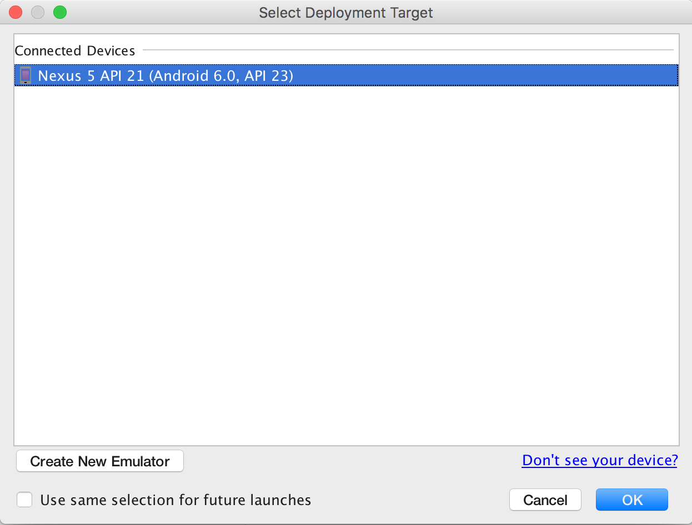

# Androidプロジェクトの構成

Android Studioを起動すると、下のようなダイアログが表示されると思います。



`Start a new Android Studio Project`を選択して、新しいプロジェクトを作成しましょう。



```
Application name: MarketApp
Company Domain: android.cookpad.com
```

`Application name`と`Company Domain`を変更しましょう。



今回はスマートフォンアプリを作成するので、Phone and Tabletにチェックが入ってる状態で問題ありません。
Minimum SDKによって、どこまで古いOS versionをサポートするか変更できます。
今回はサンプルアプリを作るだけなので、デフォルトの設定のままOS 4.1以上をサポートすることにしましょう。



初期画面の選択をします。
Empty Activityを選択し、次に進みましょう。



初期画面の名前や、関連のファイル名の変更ができますが、
何も変更せず`Finish`を選択しましょう。

# プロジェクトの構成

プロジェクトツリーの表示方法はいくつかありますが、Projectを選択するとディレクトリ構造と同じになるのでおすすめです。





### app モジュール

アプリ(やライブラリ)はモジュールという単位で管理されています。 一つのプロジェクトに複数のモジュールを共存させることも可能です。
app という名前には特に意味はなく、Android Studioでプロジェクトを作成すると、デフォルトでapp モジュールにHello Worldのプログラムが作成されます。

### java ディレクトリ

javaディレクトリでは、アプリケーションコードを管理します。
ファイルが増えてくると管理が難しくなるので、適切にパッケージ(ディレクトリ)を分けましょう。

### res ディレクトリ

リソースディレクトリでは、アプリの素材画像、xmlのレイアウト、アイコン用の画像ファイル、文字列、数値などを管理します。
文字列や数値をアプリケーションコードとは別で管理することで、表示言語の国際化(i18n)やマルチデバイスに対応する事が出来ます。

### AndroidManifest

アプリのメタ情報がXML形式で記述されています。
新たにパーミッションを追加する場合や、画面(Activity)を作成した場合はAndroidManifestに追記する必要があります。

### build.gradle

ビルドする際の設定を記述します。
build.gradleは、rubyでいうところの`Gemfile`の役割も備えているので、
ライブラリを利用する際は、使用するライブラリをbuild.gradleのdependenciesに記述します。

# gitによる管理

Railsの講義と同様に、Androidの講義で作成したアプリはGithub上に提出してもらいます。
そのため、Androidのプロジェクトもgitで管理しておきましょう。

ターミナルから、いま作成したプロジェクトのrootディレクトリに移動して、
`git init`を行い、この段階で初コミットをしましょう。
今後のコミットするタイミングについては、各々の判断におまかせします。

# Hello Worldを実行する

プロジェクトを作成した段階で、Hello worldを表示するプログラムが組まれています。
実際に、Hello worldを手元のエミュレータで実行させてみましょう。
緑色の再生ボタンを押すと、ビルドが開始されます。



端末選択画面が表示されたら、起動しているエミュレータを選択し、OKでアプリを起動させましょう。




