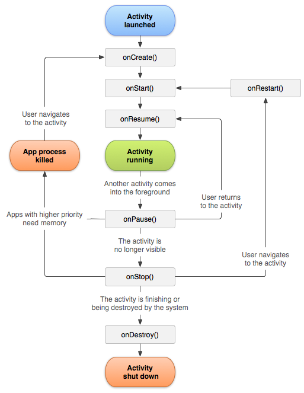

# Activity と Fragment

## Activity

[Activity (API Guides)](https://developer.android.com/guide/components/activities.html?hl=ja)

ActivityはMVCのControllerに近いもので、一画面に一つ存在します。
プロジェクトには既に`MainActivity`という名前のActivityが存在しています。このActivityは先程アプリを実行した際に呼び出されて"Hello World!"を表示していました。
アプリ上で画面遷移を行いたい場合は、Acitivityを追加することで遷移先の画面を用意し、画面間の切り替えをIntentという仕組みで実現します。
Acitivity自体がViewに近い役割を持っていますが、レイアウトの構造は別途XMLで定義して設定します。

```java
//最もシンプルなActivtyの構成
public class MainActivity extends AppCompatActivity {
  @Override
  protected void onCreate(Bundle savedInstanceState) {
    super.onCreate(savedInstanceState);
    //レイアウト定義をセット
    setContentView(R.layout.activity_main);

    // Intentを使った画面遷移
    Inetnt intent = new Intent(this, AnotherActivity.class);
    startActivity(intent);
  }
}
```

```xml
<!-- レイアウトの定義(activity_main.xml) -->
<?xml version="1.0" encoding="utf-8"?>
<RelativeLayout
        xmlns:android="http://schemas.android.com/apk/res/android"
        xmlns:tools="http://schemas.android.com/tools"
        android:layout_width="match_parent"
        android:layout_height="match_parent">
    <TextView
            android:text="Hello World!"
            android:layout_width="wrap_content"
            android:layout_height="wrap_content"/>
</RelativeLayout>
```

```xml
<!--- AndroidManifest.xmlに追記する -->
<activity android:name=".MainActivity">
    <intent-filter>
        <!--- このアプリのエントリーポイントであるという宣言 -->
        <action android:name="android.intent.action.MAIN"/>
        <!--- このActivtyをランチャーアプリに表示させるための宣言 -->
        <category android:name="android.intent.category.LAUNCHER"/>
    </intent-filter>
</activity>
```

## Activtyとライフサイクルイベント

Activityを継承したクラスは原則として初期化処理にコンストラクタを利用しません。
Activityにはライフサイクルという仕組みがあります。Activityに定義されているライフサイクル メソッドが順番にコールされるので、それらをOverrideして任意の処理を記述していきます。



一番初めに呼ばれる`onCreate`では、各フィールドの初期化やレイアウトファイル設定など普段コンストラクタに記述するであろう内容を書きます。
逆に一番最後に呼ばれる`onDestory`ではActivityが破棄される時に行いたい処理を記述します。  
Activityは他の画面に遷移すると"中断"という状態になります。この時呼ばれるのが`onPause`です。
例えばActivity上で動画を再生していたら、このタイミングで一時中断することを検討しましょう。  
また、他の画面から返ってきた場合には`onResume`というイベントが呼ばれます。
もしTwitterのタイムラインのようなものを実装していたら、このタイミングで新しいツイートが存在するかサーバーに問い合わせを行うと良いと思います。

## Androidプログラミングの難しさ

Androidアプリの開発の難しさの一つは上記で紹介したActivityの複雑なライフサイクルの構造にあります。
生成されたインスタンスが破棄されることなく、何度もライフサイクルイベントのループを経験する可能性があるので、
様々なタイミングでイベントが発火してもクラッシュしないようにするためには、ライフサイクルの理解が不可欠です。  
シンプルなアプリを開発している時はに`onCreate`にベタ書きするスタイルで問題ないことが多いですが、
アプリが複雑になるにつれて`onCreate`だけでは要件を満たせない事が増えてくると思うので、徐々にライフサイクルを学んでいきましょう。

## Fragment

[Fragment(API Guides)](https://developer.android.com/guide/components/fragments.html?hl=ja)

多機能なアプリ増えていく中で、複雑になりすぎたActivityを分割する役割として、OS3.0からFragmentが登場しました。
基本的な構造はActivtyと多くの共通点がありますが、AndroidManifestへの記載が不要である点や起動の仕方が異なります。
またActivtyと異なり単体では存在できません。FragmentはActivityの中で一つのレイアウトパーツとして振る舞います。

```java
public class CategoryFragment extends Fragment {
  //レイアウト定義をセットする
  @Override
  public View onCreateView(LayoutInflater inflater, ViewGroup container, Bundle savedInstanceState) {
    View view = inflater.inflate(R.layout.fragment_category, container, false);
    return view;
  }

  @Override
  public void onViewCreated(View view, @Nullable Bundle savedInstanceState) {
    super.onViewCreated(view, savedInstanceState);
    // 初期化などを行う
  }
}
```

```xml
<?xml version="1.0" encoding="utf-8"?>
<RelativeLayout
        xmlns:android="http://schemas.android.com/apk/res/android"
        xmlns:tools="http://schemas.android.com/tools"
        android:layout_width="match_parent"
        android:layout_height="match_parent">
    <TextView
            android:text="Hello World!"
            android:layout_width="wrap_content"
            android:layout_height="wrap_content"/>
</RelativeLayout>
```

```java
// 呼び出し方(Activity内部での処理を想定)
FragmentTransaction transaction = getSupportFragmentManager().beginTransaction();
// Activity上のR.id.fragment_containerの領域をCategoryFragmentに置き換える
transaction.replace(R.id.fragment_container, new CategoryFragment());
transaction.commit();
```

## ２つのFragment実装

Androidの新しいOSで提供された機能を古いAndroid端末でも使えるようにするために、Googleが公式に提供しているバックポートライブラリをサポートライブラリと呼ばれています。
このような理由でFragmentはSDKに含まれている`android.app.Fragment`とサポートライブラリ版の`android.support.v4.app.Fragment`の２つの実装があります。
どちらを使うべきかという議論がしばしば出るのですが、Cookpadではサポートライブラリ版を利用しています。
Fragmentは3.0で登場してから幾つかのマイナーチェンジがありAPIレベル毎に微妙に挙動が違うのでその差を埋めるために敢えてサポートライブラリを利用しています。
サポートライブラリを利用する場合には、`app/build.gradle`にv4 support libraryを追加します。

```groovy
buildscript {
    ext {
        supportLibraryVersion = '24.0.0'
    }
}

dependencies {
    compile "com.android.support:support-v4:$supportLibraryVersion"
}
```

## Framgnetとライフサイクルイベント

Fragmentにもライフサイクルがあり残念ながらActivityを遥かに超える複雑な構造です。
Activityのライフサイクルとの比較されたポスターがあるので興味あったら参照してみてください。  
[ACTIVITY&FRAGMENTライフサイクルポスター(TECHBOOSTER)](http://techbooster.org/android/environment/17001/)

Fragmentはとても複雑で詳細な仕様まで踏み込むと1冊の本が書けるほどです。(細かい挙動に興味を持ったら[`Master of Fragment`](http://tatsu-zine.com/books/master-of-fragments)を読みましょう)
とはいえ上記の作法さえ知っていれば最低限使いこなすことが出来ます。FragmentもActivityと同様に実際に使っていく中でライフサイクルを理解していきましょう。
肝心の具体的なFragmentの用途ですが、画面の一部が部分的に切り替わるようなスタイルのアプリを書きたい場合に非常に役に立ちます。
下のスクリーンショットはTwitterのものですが、Pagerで画面をスワイプした場合はFragmentが切り替えで表現されていて、詳細画面への遷移はActivityの切替で実現されています。


