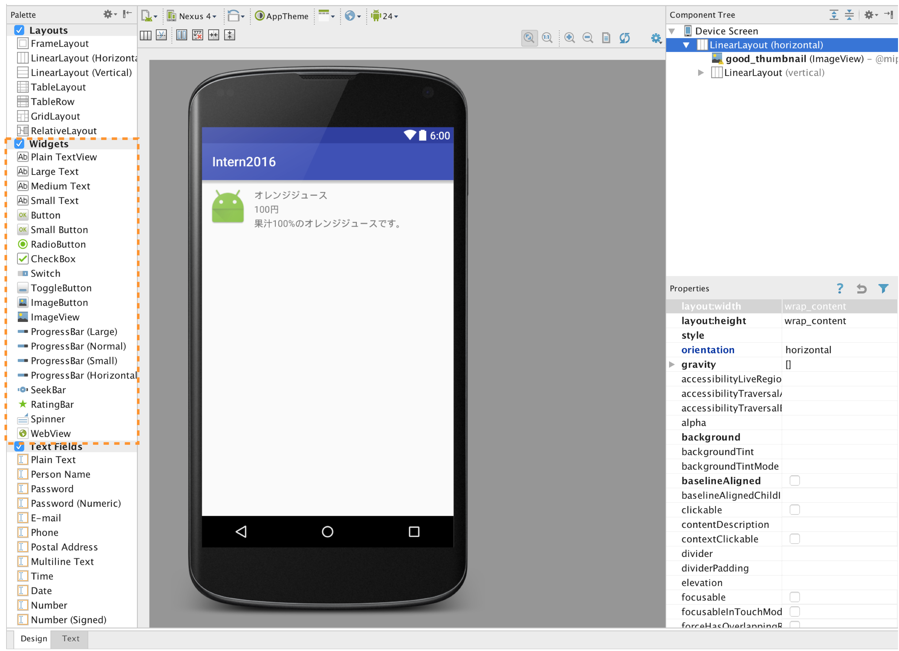

# XMLでレイアウトを表現する

文字列を表示するTextView、画像を表示するImageViewなど、画面パーツの最小単位がViewです。

```xml
<TextView
  android:text="@string/hello_world"
  android:layout_width="match_parent"
  android:layout_height="wrap_content" />
<ImageView
  android:src="@drawable/sample_image"
  android:contentDescription="@string/sample_image"
  android:layout_width="wrap_content"
  android:layout_height="wrap_content" />
```

### Viewのサイズを指定する

Viewは必ず`layout_width`と`layout_height`を指定する必要があります。
Viewの大きさは数値で設定する場合と、`MATCH_PARENT`、`WRAP_CONTENT`などの特別な値を設定する場合があります。
`MATCH_PARENT`はcssで幅を100%に指定するのに似ていて、親要素いっぱいにviewの幅を設定します。
`WRAP_CONTENT`はviewの内容が表示できるぎりぎりの幅にviewサイズを設定します。
例えば、TextViewの縦幅を`WRAP_CONTENT`に設定すると、文字の縦幅がviewの高さになります。

```xml
<TextView
    android:layout_width="match_parent" <!---親要素の横幅に合わせる-->
    android:layout_height="wrap_content" <!---表示するコンテンツの幅に合わせる-->
    />

<TextView
    android:layout_width="120dp" <!---120dpに幅を設定する-->
    android:layout_height="@dimen/sample_textview_height" <!---values/dimens.xmlにsample_textview_heightとして登録されている値を設定する-->
    />
```

```xml
<!---values/dimens.xml-->
<resources>
  <dimen name="sample_textview_height">40dp</dimen>
</resources>
```

### pxとdpとsp

Androidのデバイスはピクセル密度(1インチの中にどれくらいピクセルが入るか)によって mdpi(x1.0), hdpi(x1.5), xhdpi(x2.0), xxhdpi(x3.0)というグループにクラスタリングされています。
dpでサイズを指定することで、各クラスタに合わせたスケールした値を設定できます。

例えば`android:layout_width="20dp"`と指定した場合に、mdpiでは横幅が20pxになり、xxhdpiでは横幅が60pxになります。

また、Androidは「ユーザー補助」の設定で文字サイズを変更することができます。
文字サイズはspで指定することで、文字サイズの設定をアプリ内の文字にも適応することができます。

より詳しい解説はこちらがとても参考になります。[いまさら聞けないdp入門](http://qiita.com/nein37/items/0a92556a80c6c14503b2)

AndroidがどのようなViewを提供しているか調べるときは、Paletteを見てみましょう。



今回使うTextViewとImageViewだけ説明します。

### TextView

文字列を表示するにはTextViewを使用します。

```xml
<TextView
    android:id="@+id/comment_text"
    android:text="@string/hello"
    android:textSize="18sp"
    android:textColor="#333333"
    android:padding="4dp"
    android:layout_margin="4dp"
    android:layout_width="wrap_content"
    android:layout_height="wrap_content"/>
```

#### android:id
Viewを一意に識別するidを設定します。`@+id/`の部分は新しいidを追加するという意味があります。
後述しますが、ActivityのJavaコードからViewを取得する際に、この値を使用することになります。

#### android:text
このTextViewに表示する文字列を設定します。サンプルコードでは`@string/hello`と記述されていますが、これは/res/valuesディレクトリのstrings.xmlのhelloを表示せよという意味があります。

```xml
<!-- strings.xml -->
<resources>
  <string name="hello">Hello world!</string>
</resources>
```

このリソースファイルに記述することによって、ユーザーの使用言語によって表示する文字列を変えることができるようになります。
サンプルアプリなので、いちいちリソースファイルに定義するのが面倒！ということであれば直接文字列を書くことも可能です。

```xml
<TextView
    android:text="hello world!"
    android:layout_width="wrap_content"
    android:layout_height="wrap_content"/>
```

#### android:textSize
文字の大きさを指定します。
ここには単純にpxで指定したり、Webでよく見られるptという単位で指定することも可能ですが、たいていピクセル密度やユーザーの文字サイズ設定が考慮されるspを使用します。

#### android:textColor
文字の色を指定します。

#### paddingとmargin
Webと同じようにpaddingとmarginを設定することができます。ここで指定する値もdpで指定しましょう。
Webとの違いは隣り合う要素でmarginが打ち消し合わないことです。

### ImageView

```xml
<ImageView
    android:id="@+id/thumbnail_image"
    android:src="@drawable/thumbnail_of_recipe"
    android:layout_width="wrap_content"
    android:layout_height="wrap_content"/>
```

#### android:src
表示する画像を指定します。
サンプルコードでは`@drawable/thumbnail_of_recipe`と記述されていますが、これは/res/drawableディレクトリのthumbnail_of_recipe.pngという画像を表示せよという意味があります。画像リソースはresディレクトリ配下のmipmap-xxxもしくはdrawable-xxxというディレクトリに配置します。

#### ピクセル密度による画像の出し分け
画像リソースを配置するディレクトリはピクセル密度によって分けられており、drawable-hdpiやdrawable-xxhdpiなどの各ディレクトリに、大きさの異なる画像を配置します。

```
.
├── drawable-hdpi
│   └── thumbnail_of_recipe.png
├── drawable-mdpi
│   └── thumbnail_of_recipe.png
├── drawable-xhdpi
│   └── thumbnail_of_recipe.png
└── drawable-xxhdpi
    └── thumbnail_of_recipe.png
```

srcに画像を指定する時には`@drawable/thumbnail_of_recipe`と指定するだけで、端末のピクセル密度によって自動的に適切な画像が読み込まれます。

#### drawable vs mipmap

ひとまずはmipmapにはアプリアイコンを、drawableにはその他の画像を配置する場所だという認識で問題ありません。
詳しくは公式ドキュメントのmipmapの解説を参照してください。
https://developer.android.com/about/versions/android-4.3.html#MipMap

mipmapディレクトリの画像を参照する場合はsrcを以下のように記述します。

```xml
@mipmap/ic_launcher
```

### ViewGroup(Layout)

ViewGroupは子要素のviewをどのように並べるか、指定することができます。
開発では`LinearLayout`, `RelativeLayout`, `FrameLayout`あたりをよく使うのですが、
今回は`LinearLayout`の使い方について紹介します。

#### LinearLayout

LinearLayoutは、子要素にもつviewを(横|縦)に並べることが出来ます。
viewを並べる向きは`android:orientation`で指定することが出来ます。
`android:orientaion`属性は必須要素なので必ず指定しましょう。

```xml
<LinearLayout
    xmlns:android="http://schemas.android.com/apk/res/android"
    android:orientation="vertical"  <!---横並びの時はandroid:orientation="horizontal"-->
    android:layout_width="match_parent"
    android:layout_height="match_parent">
  <TextView
      android:layout_width="match_parent"
      android:layout_height="wrap_content"
      android:text="TextView 1" />
  <TextView
      android:layout_width="match_parent"
      android:layout_height="wrap_content"
      android:text="TextView 2" />
  <TextView
      android:layout_width="match_parent"
      android:layout_height="wrap_content"
      android:text="TextView 3" />
</LinearLayout>
```

### Gravity

Viewを右寄せ、中央寄せなどしたい場合には  `gravity`属性を利用します。
`gravity`は設定したviewではなく、その子要素に影響することを忘れないようにしましょう。
`activity_main.xml`を以下のように書き換え、gravityを色々変えてみて試してみましょう。

gravityにして出来る値は、以下の7つです。

* left
* right
* top
* bottom
* center (中央揃え)
* center_horizon (水平方向のみ中央揃え)
* center_vertical (垂直方向のみ中央揃え)

```xml
<?xml version="1.0" encoding="utf-8"?>
<LinearLayout
    xmlns:android="http://schemas.android.com/apk/res/android"
    android:orientation="vertical"
    android:gravity="center"
    android:layout_width="match_parent"
    android:layout_height="match_parent">
  <ImageView
      android:id="@+id/thumbnail_image"
      android:src="@mipmap/ic_launcher"
      android:layout_width="100dp"
      android:layout_height="100dp"/>
</LinearLayout>
```

## DataBindingを利用する

通常XMLで定義したViewにActivityなどからアクセスする場合、`Activity#findViewById`や`Fragment#findViewById`でidをもとにインスタンスを取得します。

```java
public class MainActivity extends AppCompatActivity {
  private TextView textView;

  @Override
  protected void onCreate(Bundle savedInstanceState) {
    super.onCreate(savedInstanceState);
    setContentView(R.layout.activity_main);
    textView = (TextView)findViewById(R.id.text_view);
    textView.setText("Update text");
  }
}
```

上記をDataBindingライブラリを利用して書き換えると以下のようになります。

```java
public class MainActivity extends AppCompatActivity {

  private ActivityMainBinding binding;

  @Override
  protected void onCreate(Bundle savedInstanceState) {
    super.onCreate(savedInstanceState);
    binding = DataBindingUtil.setContentView(this, R.layout.activity_main);
    binding.textView.setText("Update text");
  }
}
```

見比べてもほとんど違いが無いよう見えますが、
* レイアウトが複雑になると比例して増える`findViewById`の羅列を書かないで済む
* XyzActivityBindingというクラスはXMLから自動生成されるので確実に存在する要素にしかアクセス出来ない(キャストも不要)

というメリットがあります。また今回は紹介しませんがモデルの値とTextViewの内容をbindして同期させるなど、
かなり高度なDataBindingライブラリとしても使うことが出来ます。

DataBindingを利用するには`app/build.gradle`を次のように変更しましょう。

```groovy
android{
    dataBinding {
        enabled = true
    }
}
```

レイアウトファイル側も対応が必要で、DataBindingライブラリの対象であることを示すために、XMLの一番親を`<layout></layout>`で囲みます。

```xml
<?xml version="1.0" encoding="utf-8"?>
<layout xmlns:android="http://schemas.android.com/apk/res/android">
    <RelativeLayout
            android:layout_width="match_parent"
            android:layout_height="match_parent"
            android:paddingLeft="@dimen/activity_horizontal_margin"
            android:paddingRight="@dimen/activity_horizontal_margin"
            android:paddingTop="@dimen/activity_vertical_margin"
            android:paddingBottom="@dimen/activity_vertical_margin"
            tools:context="com.cookpad.android.internpreapp.MainActivity">

        <TextView
                android:id="@+id/text_view"
                android:text="Hello World!"
                android:layout_width="wrap_content"
                android:layout_height="wrap_content"/>
    </RelativeLayout>
</layout>
```

FragmentでもActivityの時と同様にDataBindingを利用可能です。

```java
public class CategoryFragment extends Fragment {

 private FragmentCategoryBinding binding;

 @Override
 public View onCreateView(LayoutInflater inflater, ViewGroup container, Bundle savedInstanceState) {
   binding = DataBindingUtil.inflate(inflater, R.layout.fragment_category, container, false);
   return binding.getRoot();
 }
}
```
