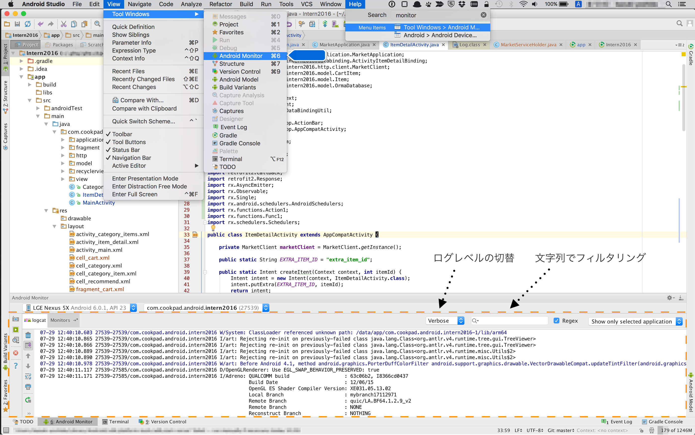
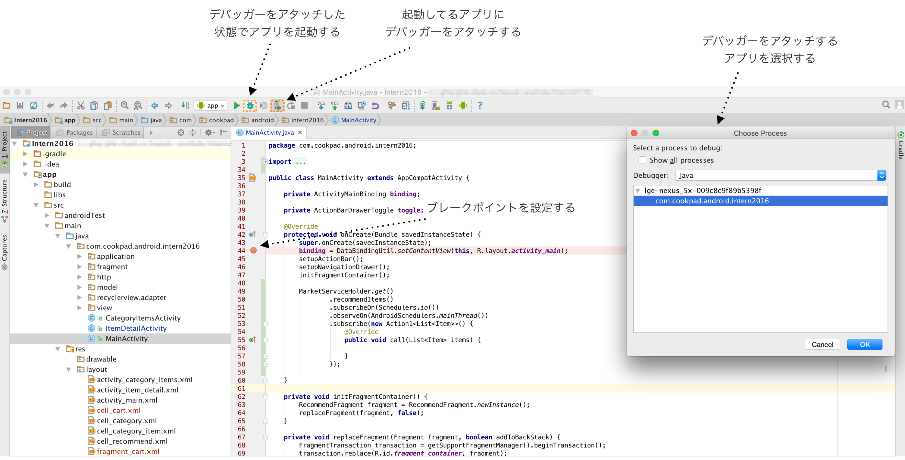
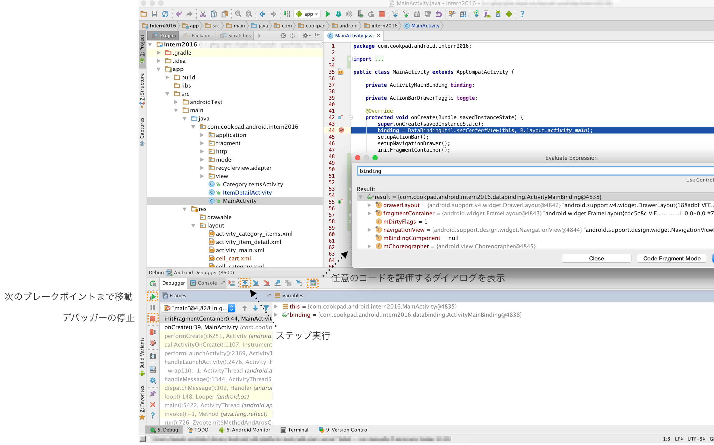
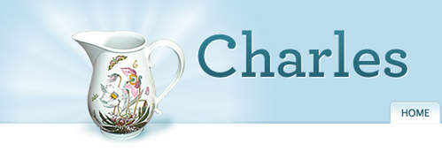
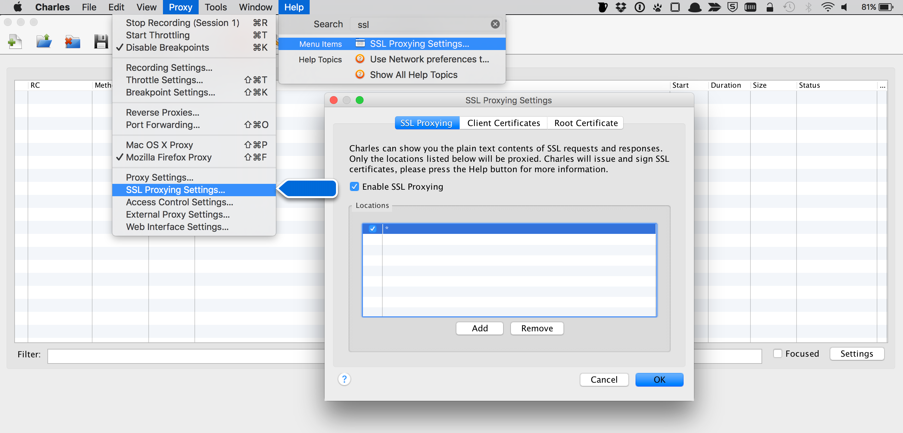
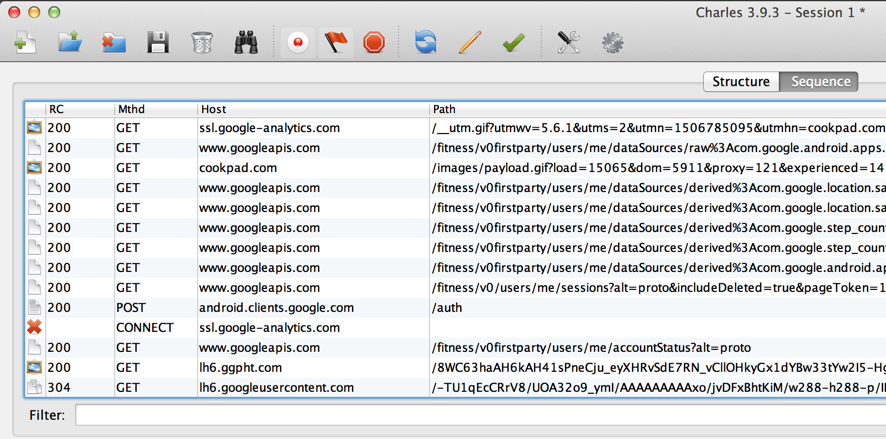
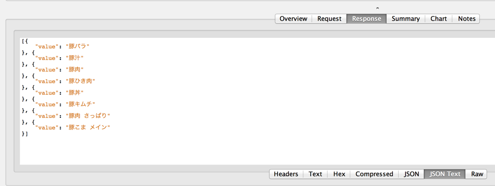
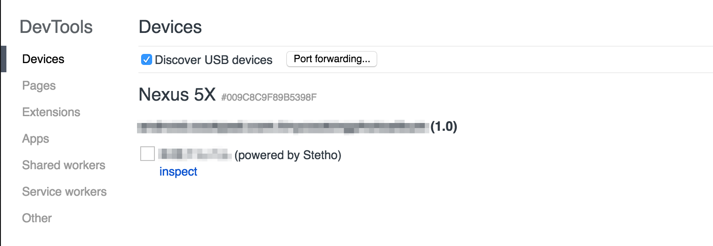

# 詰まった時のデバック

Android開発で実装が上手く行かない場合次の手段でデバッグを行うことが出来ます。

* Logクラスを利用してprintfデバッグを行う
* AndroidStudioのデバッガー機能を利用してブレークポイントを貼り、アプリの状態を確認する
* APIとアプリの間にHTTPプロキシを挟んで通信内容を確認する
* Hierarchy ViewやStethoを利用して、Viewの構造を確認する
* Stethoを利用してSharedPreferenceやSQLiteの中身を確認する

## logcat

Androidのシステムメッセージは[logcat](https://developer.android.com/studio/command-line/logcat.html)経由で確認出来ます。
Logクラスを利用するとlogcatに任意のメッセージを表示させることが出来るので、いわゆるprintfデバッグが可能です。
メッセージの重要度は4段階あります。

```java
Log.v(String tag, String msg) //verbose:最も重要度が低い(フィルターされやすい)
Log.d(String tag, String msg) //debug 
Log.w(String tag, String msg) //warn 
Log.e(String tag, String msg) //error:最も重要度が高い(フィルターされにくい)
```

logcatは、`$YOUR_ANDROID_SDK_HOME/platform-tools` にPATHが通っていればCLI環境でもadbコマンドで見れますが、Android Studio内でも確認できます。
通常画面の下側に表示されていますが、もし見つからない場合は`View>Tool Windows>Android Monitor`から表示できます。




## デバッガ

logcatは手軽ですが、デバックするためにもっと多くの情報が欲しい場合はAndroid Studioが提供するデバッガを利用します。
ブレークポイントは複数箇所に設定することが出来ますが、閉じカッコや空行などの意味を持たない行には設定できません。
またデバッガでアプリの挙動を止めてる最中にブレークポイントを追加することも可能です。  
ブレークポイントを設定したら、通常のビルドで使用しているRunボタンの一つ隣の虫のようなアイコンをクリックします。
このボタンは、アプリをビルドしつつデバッガがアタッチした状態でアプリを起動することが出来ます。



アプリがブレークポイントで止まると、Android Studioの下半分が自動的にDebugタブに切り替わります。
この画面では、現在の変数の値の確認や任意のJavaコードの評価、ステップ実行などが行えます。
アプリの実行を再開させたい(次のブレークポイントまで移動したい)場合は、画面左の緑の三角アイコンを、デバッガをデタッチしたい場合には、画面左の赤い四角のアイコンを押します。



## Charles

アプリのソースコードレベルで問題が解決しなかった場合は、APIサーバーとの通信内容を調べます。
例えば開発中はちゃんとstagingサーバーを向いているか、ヘッダーの情報や返ってきたjsonの構造に問題は無いか等を確認します。



Charlesを使うと開発用のプロキシサーバーを簡単に用意することが出来ます。

* セットアップ

Charlesは[こちら](http://www.charlesproxy.com/download/)からダウンロード出来ます。

[端末側の対応]

* wifi設定からプロキシホスト名(開発機のローカルip)とポート(デフォルトは8888)を設定します
* ブラウザからhttp://charlesproxy.com/charles.crt にアクセスし、証明書をインストールします


 エミュレータの場合も記述する。 https://subsymbolic.net/2016/02/21/setting-a-proxy-in-android/

[開発機側の対応]

* Charlesを起動し、SSL Proxingに`Locations: *`を追加します


* 実際の画面

正常にキャプチャ出来ているとこのような画面になります



下のタブで返ってきたJSONやヘッダ情報が確認できます


*  mitmproxyについて

Charlesとほとんど同じ機能が使えるmitmproxyというCLIツールもあります。
mitmproxyについては[iOS実機のSSL通信をプロキシによって傍受したり改ざんする方法](http://qiita.com/yimajo/items/c67cb711851f747c35e5)に詳しく紹介されています。
もちろんAndroidでも利用可能です。

## Stetho

[Stetho](http://facebook.github.io/stetho/)は、Chrome Developer Toolsを利用してAndroidアプリのデバッグをサポートするライブラリです。
Stethoを有効にするのは簡単で、カスタムApplicationクラスを作り、`onCreate`で初期化するだけです。
クラスを作るだけではこのApplicationクラスは利用されてないので、AndroidManifestも更新する必要があります。

```java
public class MyApplication extends Application {
  @Override
  public void onCreate() {
    super.onCreate();
    Stetho.initializeWithDefaults(this);
  }
}
```

```xml
<application
    android:name=".MyApplication"
    android:icon="@mipmap/ic_launcher"
    android:label="@string/app_name"
    android:theme="@style/AppTheme">
```

Stethoを組み込んだ状態でアプリを起動して、Chromeで[inspect/#devices](chrome://inspect/#devices)にアクセスすると下のような画面が表示されます。
inspectを選択すると普段Chromeで利用しているインスペクタが立ち上がるので、View階層を確認したり、SharedPreferenceの値を書き換えたり、SQLiteのテーブルを見ることが出来るようになります。
他にもいろいろな機能があるので、詳細は[Stetho](http://facebook.github.io/stetho/)の公式ページを確認して下さい。


