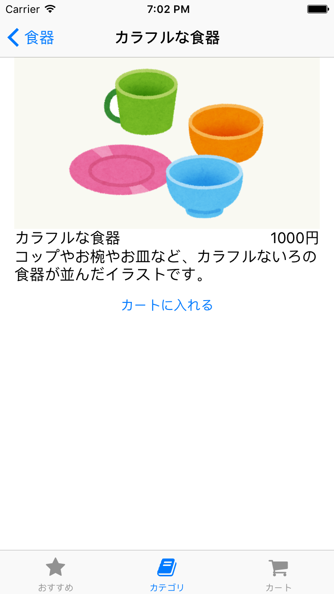

# 課題1 商品詳細画面の実装

商品の詳細情報を表示する画面を実装し、おすすめ商品一覧から選んだ商品の情報を表示できるようにしてください。

詳細画面には以下のものを表示してください。

- 商品の名前
- 商品の価格
- 商品の説明
- 商品の画像
- カートに入れるためのボタン（まだ機能しなくてよい）

## 画面例

## ヒント

- おすすめ商品一覧画面から ItemID が渡されているはずなので、その ID を使って商品の詳細情報を取得するAPIのリクエストを送信しましょう
- おすすめ商品一覧とは別のAPIのリクエストを送信する必要があるので、あたらしいリクエストを表現する構造体を定義しましょう
 - [API仕様](../../MarketApp/APIDocumentation)
- 表示する画面の構築には色々な方法があります。
 - Storyboard で ImageView や Label を配置してもよいですし、 TableView を使っても良いでしょう
 - StackView というものを使ってみてもよいかもしれません
 