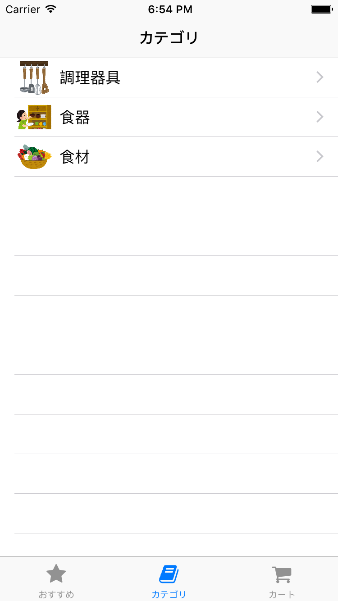
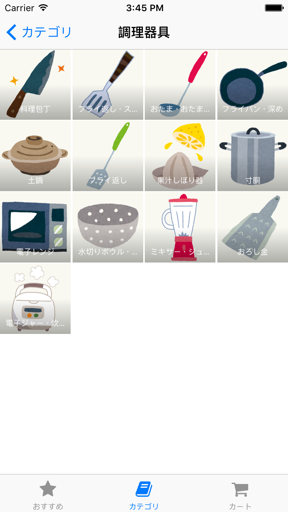

# 課題2 カテゴリ一覧画面とカテゴリ別商品一覧画面の実装

カテゴリ一覧画面とカテゴリ別の商品一覧画面を実装してください。
どちらも、用意されているWebAPIを利用して一覧を取得し、表示させてください。

## カテゴリ一覧画面

カテゴリのサムネイルと名前をセルに表示してください。
セルをタップすると、選択したカテゴリ別の商品一覧画面に遷移するようにしてください。

カテゴリ一覧画面はおすすめ一覧画面とは別のタブに表示させてください。

### 画面例

## カテゴリ別商品一覧画面

商品の一覧を UICollectionView で表示してください。
セルをタップすると、選択した商品の詳細画面に遷移するようにしてください。

### 画面例

## ヒント

- カテゴリ一覧画面を表示するためのカスタムセルを作る必要がありそうだ
- Item モデルはあったけれどカテゴリを表すモデルがないのでこれも作る必要がありそうだ
- おすすめ商品一覧とタブを分けないといけない。おすすめ商品一覧のタブを追加した時と同じ手順で追加できるのでは…？
- タブを分けたらアイコンも設定したくなった。そういえば追加したライブラリでまだ使っていないものがあった気がするぞ？
- UICollectionView の使い方がわからなかったらドキュメントを読んでみよう
- 画像のアスペクト比がなんかおかしいとおもったら、ContentMode が正しく設定されているか確認しよう
