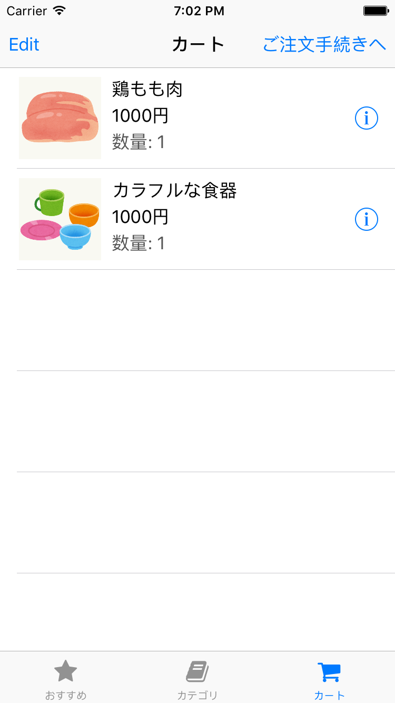

# 課題3 カートの実装

カートに入れる操作を行った商品一覧を表示する画面を作成してください。
この画面には、カートに入れた商品の名前、価格、数量を画面に表示してください。

前の課題で実装した商品詳細画面で「カートに入れる」ボタンが押された時の処理も実装する必要があります。
その際に「カートに追加しました」というメッセージをアラートで表示しましょう。

この課題ではカート内アイテムの編集やカート内容の永続化（アプリケーションを終了しても内容が残る）を考える必要はありません。

## 画面例

## ヒント

- カートの中身を表示するだけではなく、カートにアイテムを追加できるようにする必要があるのでカートを表現するクラスを作って色々なクラスから触れるようにしたほうがよさそうだ
 - シングルトン、それを Swift で実装する方法について調べてみよう
- カートに記録する情報にはどういうものがあるだろう、同じ商品をカートに追加したら数量が増えていかないとおかしいはずだから…
- どういうふうに情報を持てばいいだろうか、Dictionary? Array? 何かモデルを作る？
- アラートってどうやって表示するんだろう？ UIAlertController  を調べてみよう
