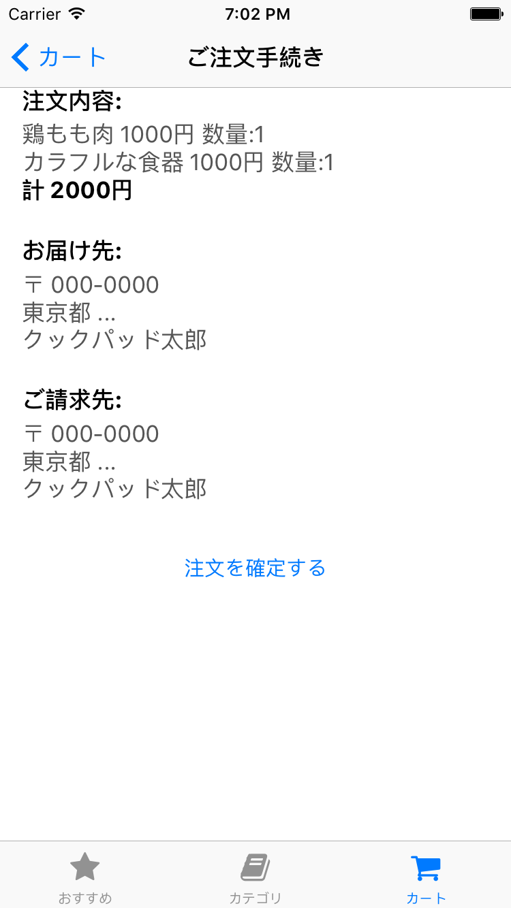

# 課題4 注文処理の実装

カート画面から注文内容の確認画面をはさみ、注文処理を実行できるようにしてください。

注文確認画面は以下のように動作してください。

- カート内アイテムの数量と合計金額を表示し、注文確定のボタンを配置する
- 注文確定のボタンをタップすると、サーバに注文リクエストを送信し成功/失敗をアラートで表示する
- 注文に成功した後にアラートを閉じたら、カートの中身をクリアして、カート画面に自動で戻る

## 画面例

## ヒント

- お届け先や請求先の情報はそれっぽいものを表示すればOKです（重要なところではない）
- カート内のアイテムによって、表示する項目が増減するので、StackView を使うとレイアウトが簡単なはず。TableViewを使っても良いけれどそんなにこった表示にはしないよね。
- POST リクエストを送信する必要があるはずだけれど、 APIKit を使えばそんなに難しくないはず。他のリクエストとちょっと違うのでドキュメントをよく読んでみよう。
- 前の課題のカートの実装がうまくいっていればカートの中身を消すのもそんなに大変じゃないよね…？
- カート画面に戻るのは NavigationController の機能をうまく使ってください
