# 講義2 クラスと Storyboard を関連付ける

最初の画面として *おすすめ商品一覧画面* を実装します。

iOS アプリの画面はいろいろな方法で実装することができますが、今回は以下の方針で実装します。

- 要素のレイアウトは Storyboard 上で行い、 AutoLayout を使う
- UITableView を使う
- UITableViewCell を継承したカスタムセルのクラスを作る

この回では、おすすめ商品一覧画面の ViewController クラスの作成と Storyboard への関連付けを行います。

## 画面例

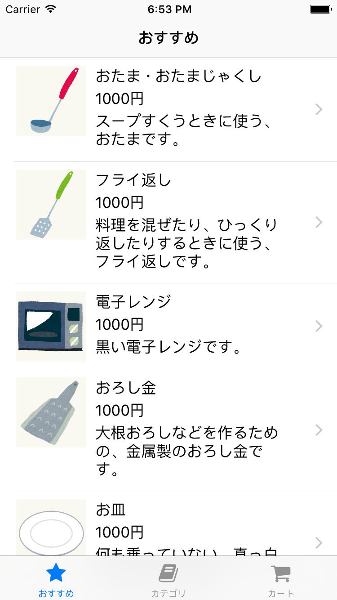

## 画面の処理を記述する ViewController クラスを作る

プロジェクトに `RecommendItemsViewController` クラスのファイルを追加します。
ViewController グループを右クリックし、 `New File...` を選択してファイルを追加します。

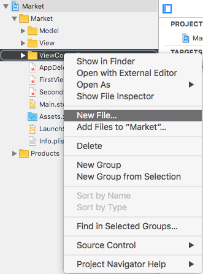

テンプレートは Cocoa Touch Class を選択してください。

以下の情報を入力してファイルを作成します。

- Class: RecommendItemsViewController
- Subclass of: UITableViewController
- Language: Swift

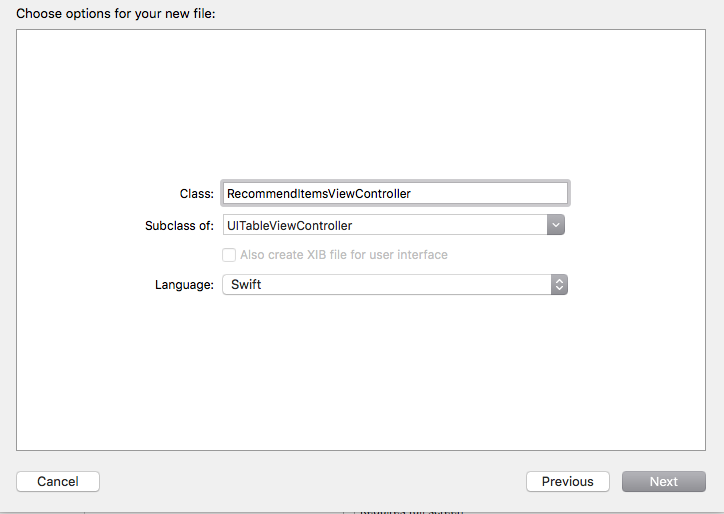

## TabBarController に新しい画面を追加する

`Main.Storyboard` ファイルを編集しておすすめ商品一覧画面の設定を行います。
`Main.Storyboard` の初期状態は以下のようになっています。

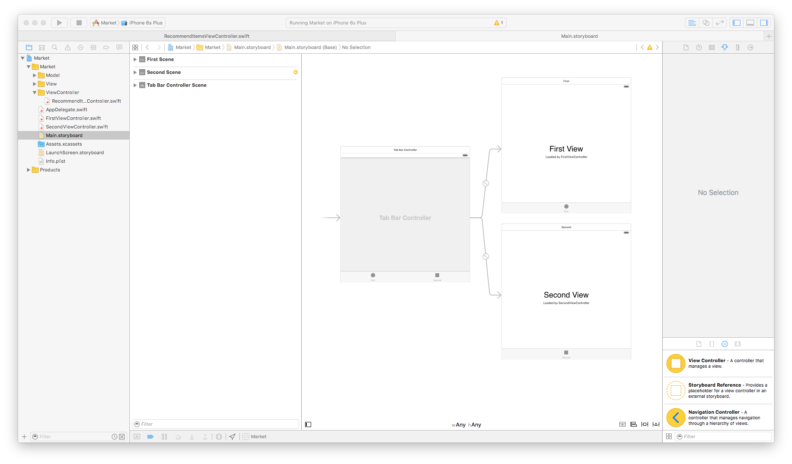

`FirstView` と `SecondView` を消して新しく `TableViewController` を追加します。
プロジェクトに元から存在する *FirstViewController.swift* 、 *SecondViewController.swift* のファイルも削除してしまいましょう。

右ペインのリストから `Table View Controller` を選択して真ん中の領域にドラッグアンドドロップします。

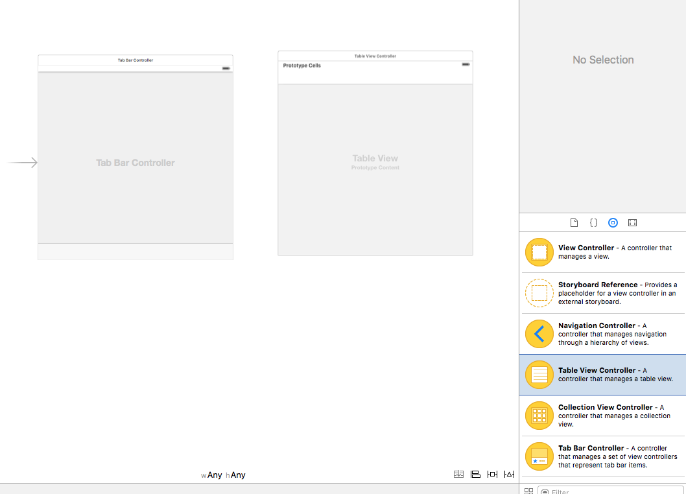

左にある Tab Bar Controller を Ctrl を押しながらクリックし、青い線を右の TableViewController に伸ばして離すと、画像の様なメニューが表示されるので `view controllers` を選択します。

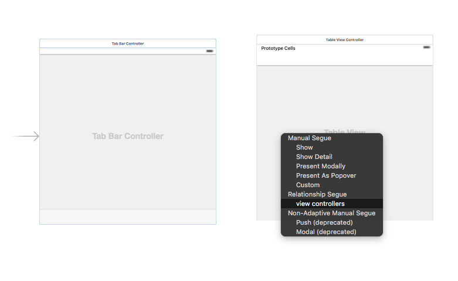

うまくいくと以下の画像のように線で結ばれます。この操作を行うことで一つだけのタブを持ち TableViewController を表示するように設定することができました。

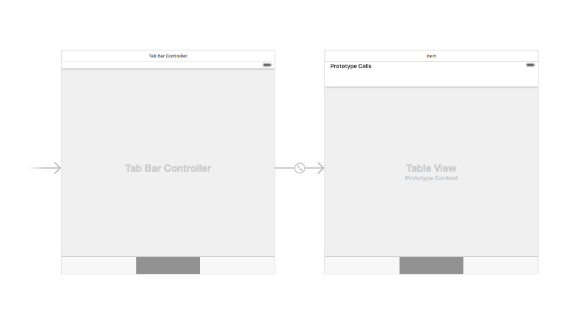

## TableViewController に RecommendItemsViewController クラスをひも付ける

追加した TableViewController を選択し、先ほどファイルを追加した RecommendItemsViewController クラスとひも付けます。
画面を選択後右ペインの項目を切り替えて、 Custom Class の項目を `RecommendItemsViewController` にします。

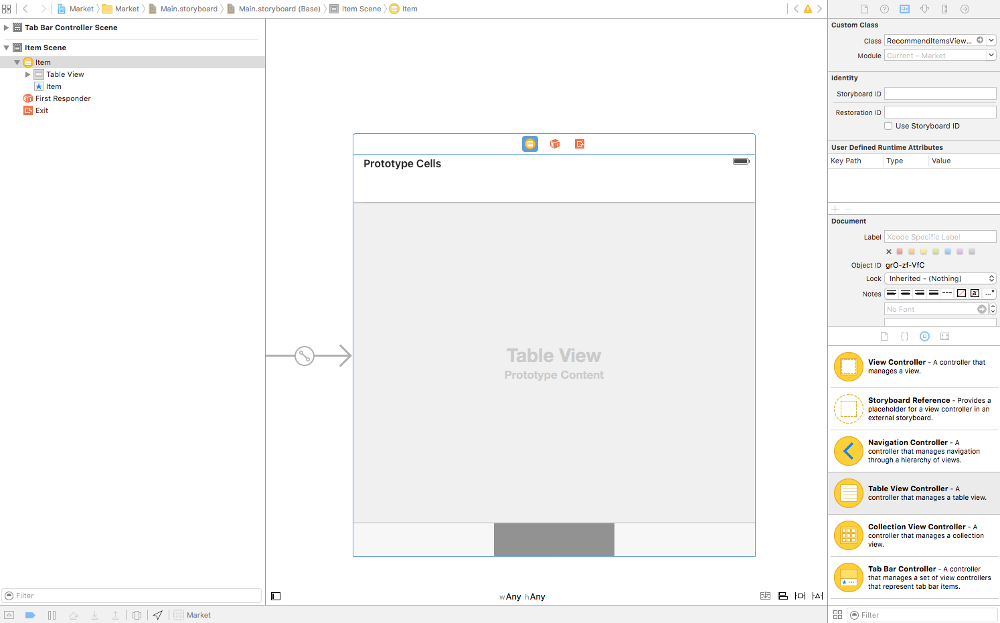

設定した TableViewController を選択した状態で `Editor > Embed In > Navigation Controller` を選択すると選択した ViewController を NavigationController の中に入れることができます。

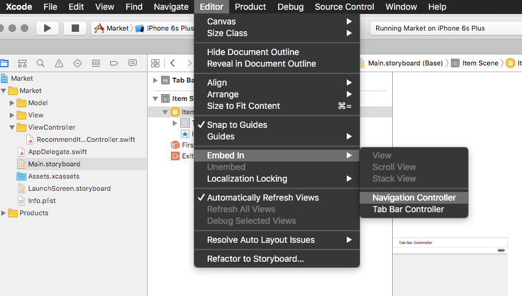

ナビゲーションバーのタイトルも設定します。
ダブルクリックするとタイトルを入力できるので、ここでは "おすすめ" としておきましょう。

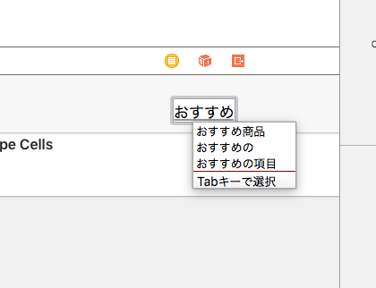

ここまで設定すると、以下の画像のようになります。

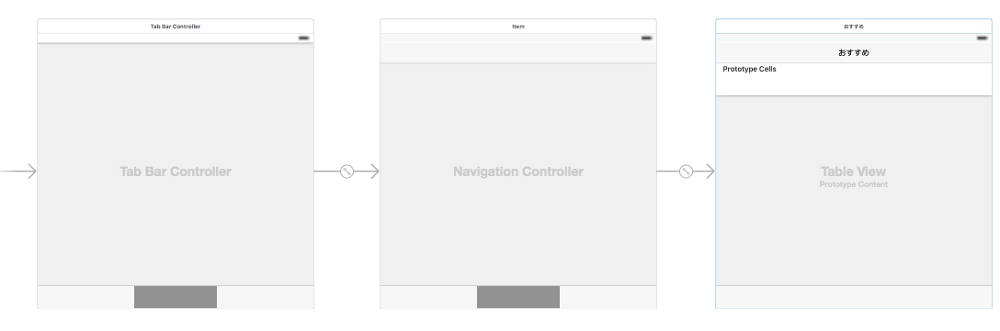

ここまで設定できたら、ビルドしてアプリケーションを実行します。
空っぽのおすすめ商品一覧画面ができました。

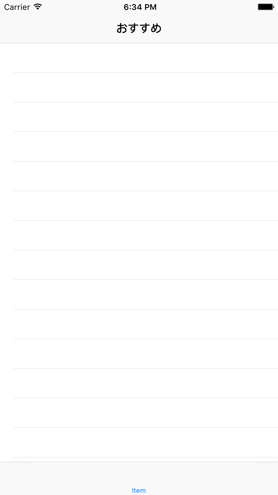
