# 講義3 画面要素の配置

この回では、 *おすすめ商品一覧画面* に並べて表示するセルの要素を配置します。

Storyboard 上でおすすめ商品を表示するセルを設定します。
設定が終わると以下の画像のようになります。

## RecommendItemCell クラスのファイルを作成する

View グループの下に `RecommendItemCell` クラスのファイルを作成します。
`RecommendItemsViewController.swift` を作成した時と同様の操作をしてください。
その際に `UITableViewCell` のサブクラスとして作成してください。

ファイルが作成できたら Storyboard 上の おすすめ商品の画面のセルを選択し、Custom Class の項目に作成したクラスを指定します。

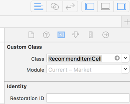

また、ReuseIdentifier にも `RecommendItemCell` を指定してください。この値は次の回で使います。

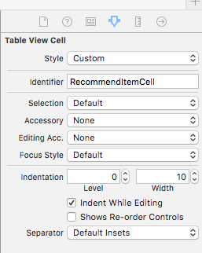

## セルの高さを変更する

おすすめ商品を表示するセルの高さは最低 **96** point とすることにします。
おすすめ商品一覧画面の TableView を選択し、右ペインの TableView セクション Row height の項目の値を **96** に設定します

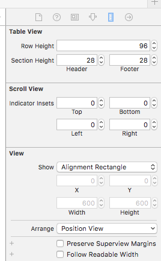

設定できると Storyboard 上の表示の高さも大きくなります。

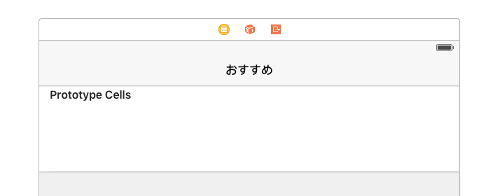

## ラベルなどの要素の配置指定

今回設定するセルには以下の要素を配置する必要があります。

- サムネイル画像を表示する ImageView
- 商品の名前を表示する Label
- 商品の価格を表示する Label
- 商品の説明を表示する Label

それぞれの要素の配置指定は以下のものとします。

### サムネイル画像

- 左マージン 8 point
- 上マージン 8 point
- 幅 80 point
- 高さ 80 point

### 商品の名前

- サムネイル画像と左端の間隔を 10 point あける
- 上マージン 10 point
- 高さ 21 point
- 右マージン 18 point

### 商品の価格

- 左端を商品の名前と揃える
- 商品の名前との間隔を 4 point あける
- 高さ 21 point
- 右マージン 18 point
 
### 商品の説明

- 左端を商品の名前と揃える
- 商品の価格との間隔を 4 point あける
- 高さ 21 point **以上**
- 右マージン 18 point
- 下マージン 14 point

## ラベルなどの要素を配置する

iOS には AutoLayout という、要素のサイズや要素間の間隔に対し制約を指定することでレイアウトを表現する仕組みがあります。
iOS 端末には複数の画面サイズや表示方向があるので、画面サイズが違っても適切に要素が配置されるようにこの仕組みが用意されています。

上記の配置指定は、AutoLayout の制約と対応するように記述しています。
これから Storyboard 上でラベルやImageView を配置して制約を設定していきます。

右ペイン下部から Image View を見つけ出し、セルにドラッグアンドドロップすることで、セルに ImageView を追加できます。ここにサムネイル画像を表示させます。
セルに追加するだけではサイズやマージンの設定がされておらず意図した場所に画像を表示できないので、制約を追加します。
画面右下に並んでいるボタンを押して、以下の画像のように設定を行い制約を追加します。

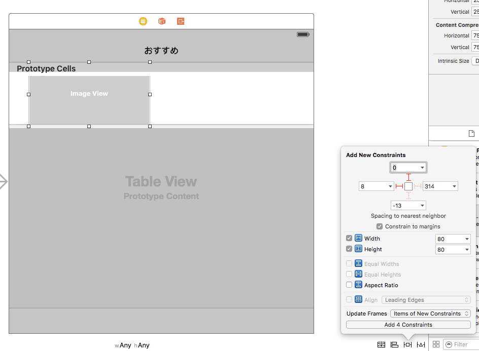

画像のマージンの指定と上記の指定の値が少し違いますが、これは Storyboard上のセルにデフォルトで 8 point ずつマージンが付いているため、その差を指定しています。
Update Frames の項目に `Items of New Constraints` を指定しておくと、制約に従って Frame の再設定を行ってくれます。
Frame とは要素の相対座標・サイズを表すものであり、現在表示しているサイズのViewに要素を配置した際の Frame も Storyboard は管理しています。
iOSは制約から最終的に Frame を計算して描画を行います。

ImageView を追加したら、右ペインの View の設定のところで Content Mode を AspectFit に切り替えてください。これにより、アスペクト比を保ったままImageViewの大きさに合わせて画像をリサイズして表示してくれます。

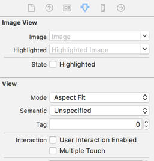

残りのラベルも配置と制約の指定を行います。
マージンの指定の値を設定する際に下三角をクリックすることでどの要素との間隔を設定するか選ぶことができます。

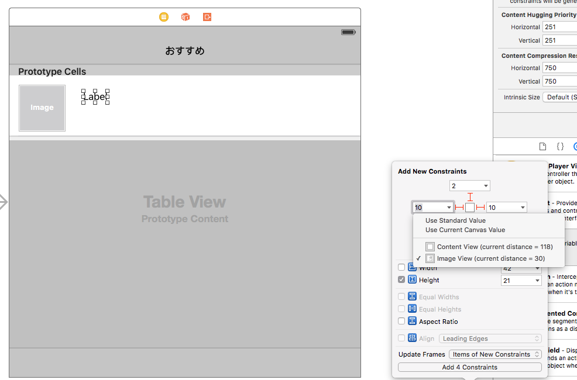

一度設定した制約の値の変更は、その要素を選択した状態で右ペインからできます。
商品の説明ラベルの高さは 21 point **以上** なので 21 point に設定したあと、Editボタンを押して 21 **以上** となるように変更します。

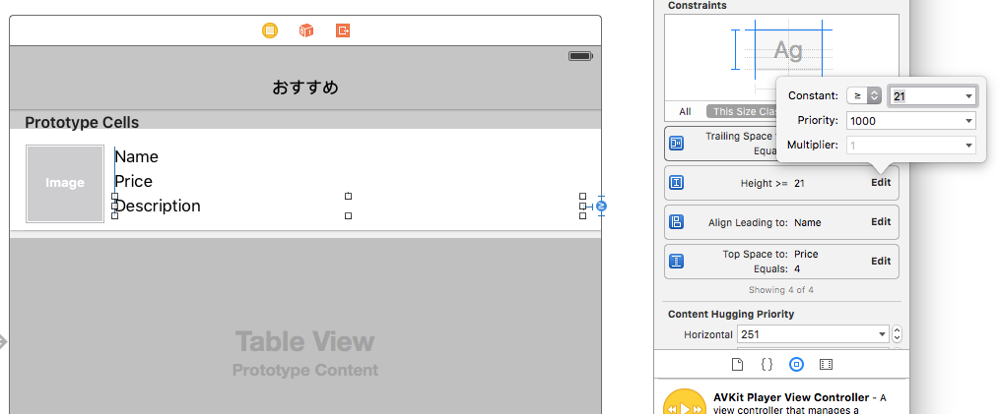

## クラスとセルの要素を結びつける

ImageView とラベルの配置ができたらこれらの要素をコードから参照できるように設定します。

まず、画面右上部の円が重なっているようなアイコンのボタンを押してAssistantEditorを表示するようにすると以下の画像のような表示になります。

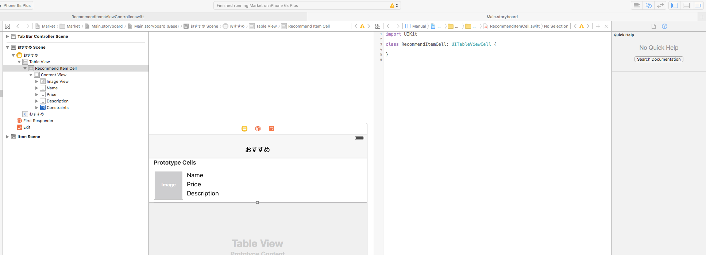

Storyboard 上の imageView を選択した状態から Ctrl を押したままドラッグすると青い線が出ます。

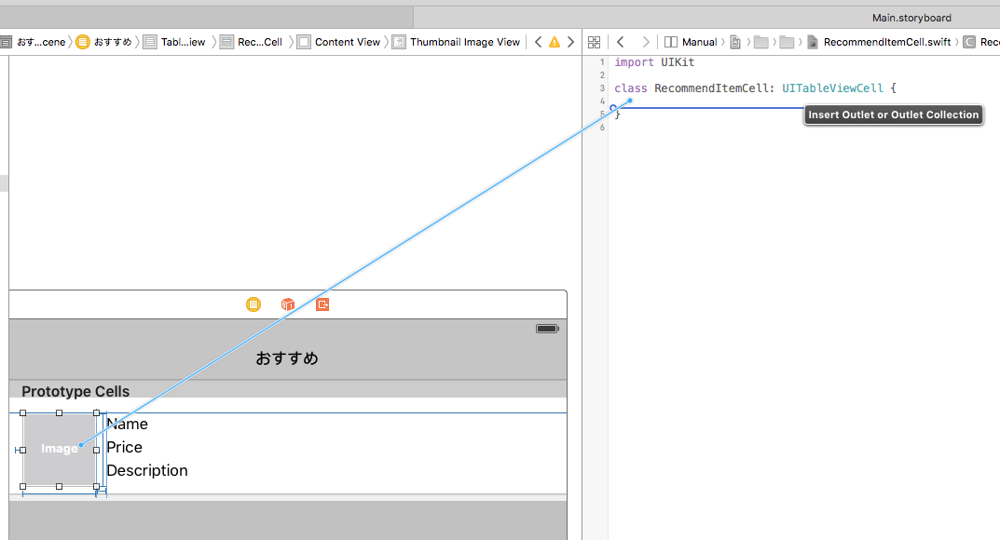

この青い線を右側のソースコード上に落とすと、以下の画像の様に RecommendItemCell のメンバ変数と要素の接続の設定ができるダイアログが表示されるので、名前をつけてメンバ変数を追加します。
imageView は `thumbnailImageView` という名前にします。

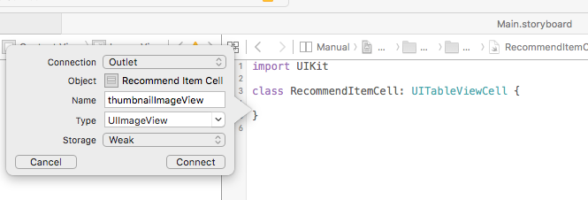

同様に他のラベル群に対しても設定を行うと、それぞれの要素にコードから参照できるようになります。
このような状態になれば完成です。

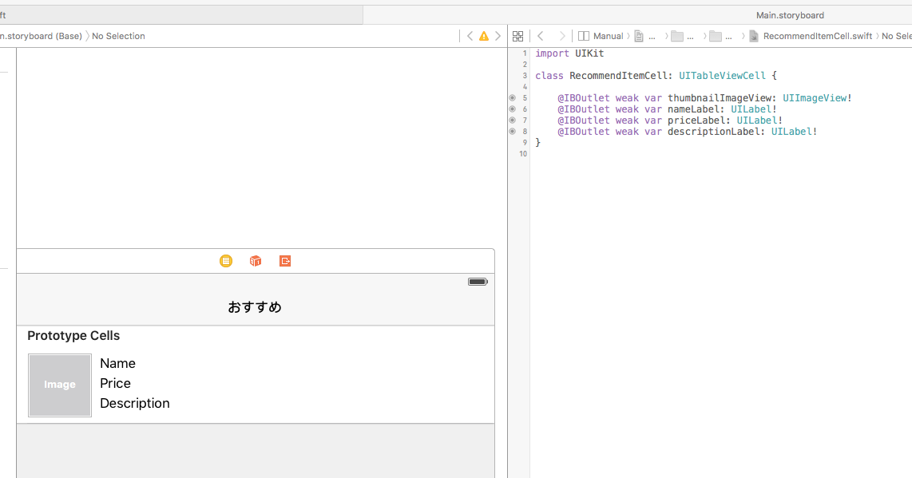
