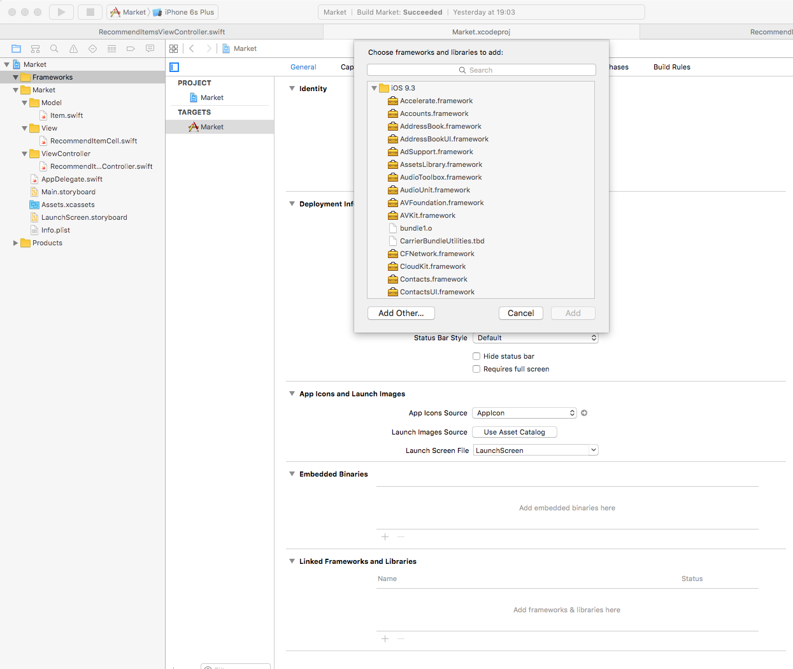
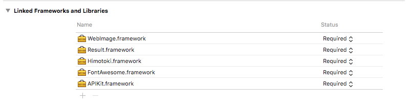
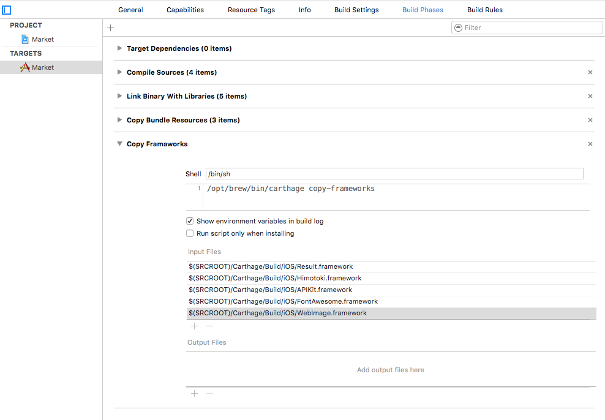

# 講義5 ライブラリの導入

iOS アプリの開発効率をあげるために様々なオープンソースのライブラリが公開されています。
ライブラリをプロジェクトに組み込むには様々な方法があります。

- ソースコードを取得して直接プロジェクトに追加する
- CocoaPods を使う - https://cocoapods.org/
- Carthage を使う - https://github.com/Carthage/Carthage

ここでは Carthage を使ってライブラリをプロジェクトに追加します。
このプロジェクトでは以下のライブラリを使用します。

- APIKit - https://github.com/ishkawa/APIKit
- Himotoki - https://github.com/ikesyo/Himotoki
- SDWebImage - https://github.com/rs/SDWebImage
- FontAwesome - https://github.com/thii/FontAwesome.swift

## Cartfile の用意

Carthage でプロジェクトに導入するライブラリを指定するには *Cartfile* というファイルを用意する必要があります。
ファイルを作成し、以下のように記述してください。

```bash
github "ishkawa/APIKit" ~> 2.0.5
github "ikesyo/Himotoki" ~> 2.1.1
github "thii/FontAwesome.swift" ~> 0.8.0
github "rs/SDWebImage" ~> 3.8.1
```

## framework のビルド

Cartfile に指定した各ライブラリは、 Carthage によってそれぞれ iOS アプリの framework としてビルドされます。
以下のコマンドを実行すると、ソースコードの取得とframeworkのビルドを行います。

```sh
carthage update --platform ios
```

## framework をプロジェクトに追加する

https://github.com/Carthage/Carthage#getting-started に従って `Carthage/Build/iOS` 以下に作られた framework らをプロジェクトに追加します。

左ペインでプロジェクトファイルを選択して表示された画面の General タブの Linked Frameworks and Libraries の項目に追加します。
+ ボタンを押した後に表示されるダイアログの "Add Other..." をクリックするとファイルが選択できるので `Carthage/Build/iOS` ディレクトリから5つの framework ファイルを選択し追加します。



以下の画像のような状態にしてください。



次に、Build Phases タブを選び、タスクを追加します。
左上の + をクリックし、 Run Script Phase を追加して以下の画像のような状態にしてください。



これらの作業により、ライブラリ群が使えるようになります。
