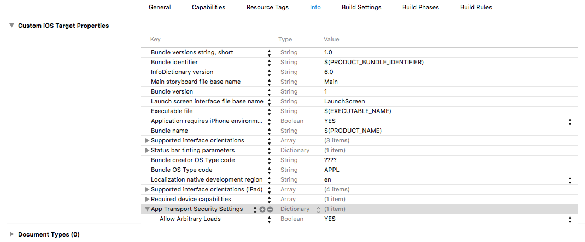

# 講義6 サーバから情報を取得して画面に反映する

講義4ではダミーのモデルを用意してTableViewの内容を表示しました。
今回はサーバから情報を取得して、その内容を画面に表示させます。


## APIサーバの起動

Market アプリが利用する API サーバの実装 utteiku3 があります。
まず、このアプリケーションを手元の環境で動かします。

## ATS の無効化

iOS9 から Apple Transport Security(ATS) という機能が入りました。
これはアプリケーションが外部サーバへ接続する際に、一定レベル以上のセキュアな接続をデフォルトで要求する機能です。条件を満たさない接続先へのリクエストは全てブロックされます。

前節で今回の講義で利用する Rails アプリケーションを起動しましたが、このアプリケーションへの接続も ATS によってブロックされてしまいます。
ATSの重要性を理解したうえで、今回の講義ではATSで守られるセキュリティ要件を満たす必要はないためこれを無効にします。

実際に配信するアプリケーションで無闇に無効とするべき機能ではありません。ドメインごとの設定もできるようになっているので、適切な設定をすべきです。

アプリケーションの ATSを無効にするには、プロジェクト設定の Info タブで以下の画像のように `App TransportSecurity Settings` の項目を追加します。この副項目に `Allow Arbitary Loads` を追加して `YES` を指定します。



## APIKit を用いたリクエストの定義

準備ができたところで API のリクエストを送信する処理を記述していきます。

APIKit はリクエストとレスポンスを抽象的に表現できて使いやすいAPIクライアントライブラリです。
今回は、おすすめ商品一覧取得APIのリクエストとレスポンスをAPIKitを用いて表現します。

### リクエストする APIの仕様

`http://localhost:3000/items/recommended.json` にリクエストを送信すると、以下の様なJSONでおすすめ商品一覧が取得できます。

```
curl -s http://localhost:3000/items/recommended.json | jq .
```

```json
[
  {
    "id": 3,
    "name": "おたま・おたまじゃくし",
    "description": "スープすくうときに使う、おたまです。",
    "price": 1000,
    "image_url": "...",
    "url": "http://localhost:3000/items/3.json"
  },
  {
    "id": 6,
    "name": "フライ返し",
    "description": "料理を混ぜたり、ひっくり返したりするときに使う、フライ返しです。",
    "price": 1000,
    "image_url": "...",
    "url": "http://localhost:3000/items/6.json"
  },
  ...
]
```

このレスポンスを元に Item モデルの配列を作ります。

### MarketRequestType を追加する

Market アプリがリクエストを送信するAPIの BaseURL を定義した MarketRequestType プロトコルを定義します。
この後に各APIのリクエストを表現する構造体をいくつか定義しますが、それらをここで定義する MarketRequestType に準拠させることで共通のBaseURLを持つように指定できます。

RequestType は APIKit に定義されているプロトコルで、リクエストを表すのに必要なHTTPMethodやパスなどが定義されていることを規定しています。
リクエストごとにこれらの値は変わるので、より具体的にリクエストを表現する構造体の方へ定義します。

```swift
import APIKit

protocol MarketRequestType: RequestType {}

extension MarketRequestType {
    var baseURL: NSURL {
        return NSURL(string: "http://localhost:3000")!
    }
}
```

### RecommendItemsRequest を定義する

`GET /items/recommended.json` のリクエストを表現する RecommendItemsRequest を実装します。
Response にはこのAPIのレスポンスをどのような型の値にマッピングするか指定します。

responseFromObject メソッドにはレスポンスの JSON からどのようにして Response 型(ここでは `[Item]`)の値を生成するか記述します。

```swift
import APIKit

struct RecommendItemsRequest: MarketRequestType {
    typealias Response = [Item]

    var method: HTTPMethod {
        return .GET
    }

    var path: String {
        return "/items/recommended.json"
    }

    func responseFromObject(object: AnyObject, URLResponse: NSHTTPURLResponse) throws -> Response {
        guard let itemDicts = object as? [[String: AnyObject]] else {
            throw ResponseError.UnexpectedObject(object)
        }

        let items: [Item] = itemDicts.map { dict in
            let id = dict["id"] as! Int
            let name = dict["name"] as! String
            let desc = dict["description"] as! String
            let price = dict["price"] as! Int
            let imageURLString = dict["image_url"] as! String
            let imageURL = NSURL(string: imageURLString)!

            return Item(id: id, name: name, desc: desc, price: price, imageURL: imageURL)
        }

        return items
    }
}
```

### リクエストを送信する

試しに定義したリクエストを送信して、正しくレスポンスを Item モデルの配列に変換できるか確認してみましょう。

定義したリクエストのオブジェクトを作り、これを `Session` クラスの `sendRequest` メソッドに渡すことでリクエストを送信することができます。
`sendRequest` メソッドはリクエストの送信後、 `Result<Request.Response, SessionTaskError>` 型の引数をひとつとるブロックを実行します。
Result 型は成功と失敗の2つの状態を表現でき、リクエストが成功した場合はレスポンスの型（ここではリクエストに定義した `[Item]`）、失敗した場合はそのエラーが含まれます。
実際にコードを見たほうが理解しやすいでしょう。

`RecommendItemsViewController` が表示された時に呼ばれる `viewWillAppear(animated: Bool)` メソッドを以下のように実装して、実行してみます。

```swift
override func viewWillAppear(animated: Bool) {
    super.viewWillAppear(animated)

    let request = RecommendItemsRequest()
    Session.sendRequest(request) { result in
        switch result {
        case .Success(let response):
            print(response)
        case .Failure(let error):
            print(error)
        }
    }
}
```

うまく定義できていればリクエストが送信され、その結果がItemモデルの配列に変換されてXcodeのコンソールに表示されるはずです。

## Himotoki を用いてリクエスト結果をモデルにマッピングする

リクエストを送信して、レスポンスのJSONからモデルへの変換もうまくいきましたが、先ほどの実装では強引なところがありました。
以下のメソッドです。

```swift
func responseFromObject(object: AnyObject, URLResponse: NSHTTPURLResponse) throws -> Response {
    guard let itemDicts = object as? [[String: AnyObject]] else {
        throw ResponseError.UnexpectedObject(object)
    }

    let items: [Item] = itemDicts.map { dict in
        let id = dict["id"] as! Int
        let name = dict["name"] as! String
        let desc = dict["description"] as! String
        let price = dict["price"] as! Int
        let imageURLString = dict["image_url"] as! String
        let imageURL = NSURL(string: imageURLString)!

        return Item(id: id, name: name, desc: desc, price: price, imageURL: imageURL)
    }

    return items
}
```

JSONの性質上、どうしてもDictionaryにデシリアライズされたものからモデルオブジェクトを作る際にダウンキャストが必要になります。
そこで Himotoki をつかってモデルにマッピングすることにします。

## Item モデルを Decodable プロトコルに準拠させる

Item モデルに Himotoki の Decodable プロトコルに準拠させるためメソッドを追加します。
このメソッドで、Dictionary の値をどのようにモデルのフィールドに対応づけるか定義します。

```swift
import Foundation
import Himotoki

struct Item {
...
}

extension Item: Decodable {
    static let URLTransformer = Transformer<String, NSURL> { URLString throws -> NSURL in
        if let URL = NSURL(string: URLString) {
            return URL
        }
        throw customError("Invalid URL string: \(URLString)")
    }

    static func decode(e: Extractor) throws -> Item {
        return try Item(id: e <| "id",
                        name: e <| "name",
                        desc: e <| "description",
                        price: e <| "price",
                        imageURL: URLTransformer.apply(e <| "image_url"))
    }
}
```

Item モデルを Decodable プロトコルに準拠させると、 Request の `responseFromObject` メソッドは以下のように書き換えることができます。

```swift
func responseFromObject(object: AnyObject, URLResponse: NSHTTPURLResponse) throws -> Response {
    return try decodeArray(object)
}
```

## APIのレスポンスを画面に反映する

リクエストを投げてレスポンスを Item モデルの配列に変換する実装ができたので、これを TableView に反映するように修正します。

`RecommendItemsViewController` の該当箇所を以下のように修正してください。

```swift
var items: [Item] = [] {
    didSet {
        tableView.reloadData()
    }
}
```

```swift
Session.sendRequest(request) { result in
    switch result {
    case .Success(let response):
        self.items = response
    case .Failure(let error):
        print(error)
    }
}
```

また、Item モデルの imageURL に正しい画像URLが入るようになったので、これを表示するように修正します。

RecommendItemCell に `import WebImage` を追加し、以下の行を`update`メソッドに足してください。

```swift
thumbnailImageView.sd_setImageWithURL(item.imageURL)
```

ビルドして実行すると、APIのレスポンスが画面に反映されるはずです。
