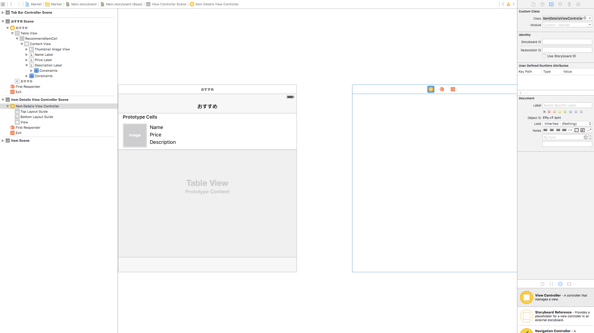
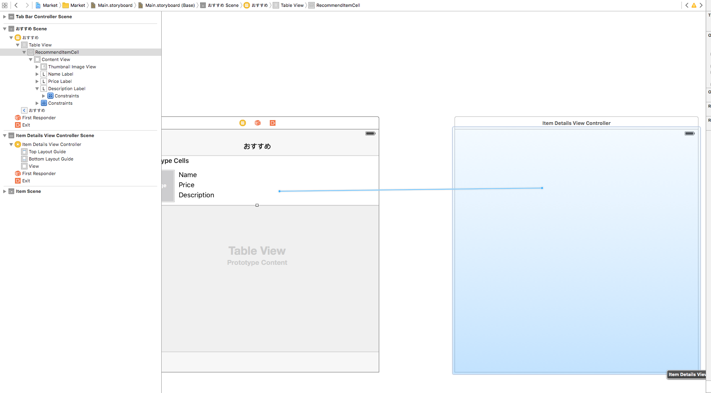
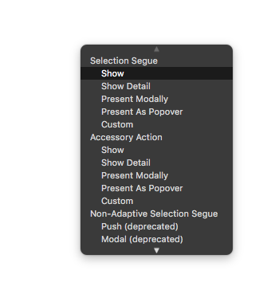
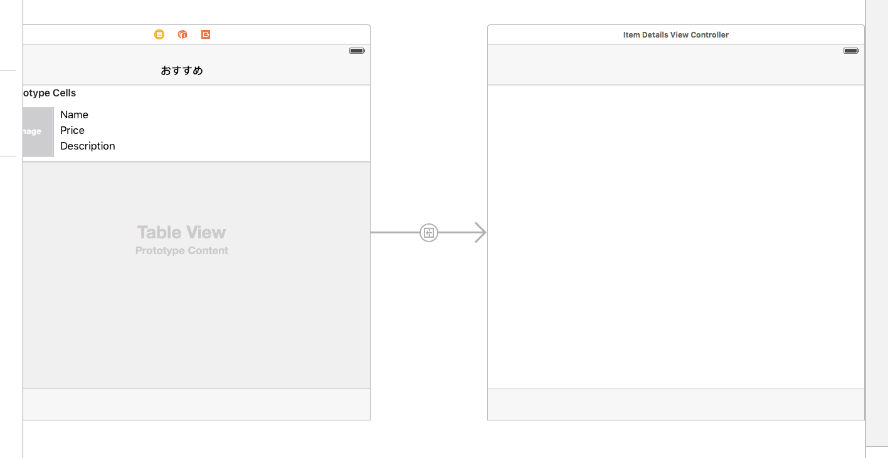

# 講義7 Storyboard を用いた画面遷移の実装

おすすめ商品一覧画面ができたので、そこから商品詳細画面に遷移できるようにします。

## ItemDetailsViewController の作成

今までと同じようにファイルの追加操作を行って、 *ItemDetailsViewController.swift* を作成します。
この際、Cocoa Touch Class テンプレートから `UIViewController` のサブクラスとしてクラスのファイルを作成してください。

次に、Storyboard でも新しい画面を追加します。
右ペインから View Controller のコンポーネントを探して、おすすめ商品一覧画面の隣にドラッグアンドドロップします。

追加した画面に `ItemDetailsViewController` クラスをひも付けてください。



## セルがタップされたら商品詳細画面に遷移するようにする

商品一覧のセルがタップされたらその商品の詳細情報が表示されることを期待するはずです。
セルがタップされたら商品詳細画面に遷移するようにします。

Storyboard でおすすめ商品一覧画面のセルを選択し、Ctrl を押しながら商品詳細画面に向かってドラッグすると青い線で接続することができます。



商品詳細画面で指を離すと以下のような選択ダイアログがが表示されるので、 Show を選択します。


接続がうまくいくと、以下のように画面が線で結ばれます。


ここまで設定をしてビルド・実行すると、セルをタップした時に白い画面に遷移し、ナビゲーションバーから元の画面に戻れることが確認できると思います。

## 画面遷移時に遷移先のViewControllerに情報を渡すようにする

遷移先の画面で商品の詳細情報を表示するためには、どの商品が選択されたかを遷移先の画面を構築するViewController に渡さないといけません。

まず、`ItemDetailsViewController` へ商品のIDを設定してもらうために `itemID` プロパティを追加します。
以下の1行を追加するだけです。単純ですね。

```swift
var itemID: Int = 0
```

また、画面が表示された時にどの itemID が設定されているかログに出力するようにしましょう。
以下の行を追加します。

```swift
override func viewWillAppear(animated: Bool) {
    super.viewWillAppear(animated)

    print(itemID)
}
```

次に `RecommendItemsViewController` へ以下のように `prepareForSegue(segue: UIStoryboardSegue, sender: AnyObject?)` メソッドを追加します。

```swift
override func prepareForSegue(segue: UIStoryboardSegue, sender: AnyObject?) {
    if let destination = segue.destinationViewController as? ItemDetailsViewController {
        guard let selectedIndexPath = tableView.indexPathForSelectedRow else {
            return
        }

        let item = items[selectedIndexPath.row]
        destination.itemID = item.id
    }
}
```

ビルドして実行し、セルをタップすると、画面が遷移して選択した商品のIDが表示されるはずです。

## 商品詳細情報の表示

[課題1](./exercise01.md) につづく… :cactus:
