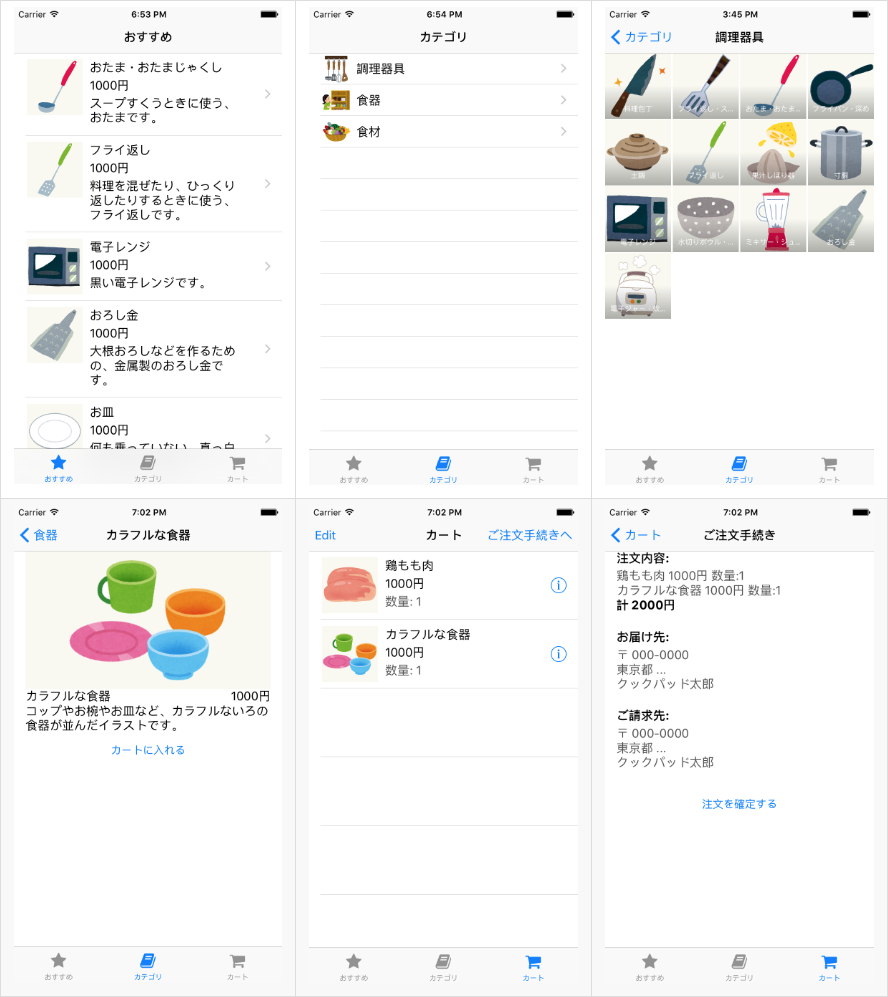

この講義で作るアプリについて説明します

# 内容

架空のネット通販サービスで商品を注文するためのiOSアプリ

- おすすめ商品の一覧を表示することができる
- カテゴリで分けられた商品の一覧を表示することができる
- ほしい商品を選択してカートに一時保存することができる
- カートに入れた商品を注文することができる

# 制限事項

- 単純にするため、ユーザアカウントの概念は省略する
- 商品の在庫は考慮しない
- カートに入れた商品はクライアントアプリの方で管理する
- 注文時は商品のIDと個数の組をサーバに送信する

# WebAPI の仕様

[APIDocumentation](./webapi.md)

# このアプリを作るために必要な知識

- iOSアプリの基本的な画面の構築方法
- iOSアプリの基本的な画面遷移の構築方法
- HTTPリクエストを発行してWebAPIを実行する方法
- HTTPリクエストのレスポンス(JSON)をパースし、モデルへマッピングする方法
- 画像の表示方法
